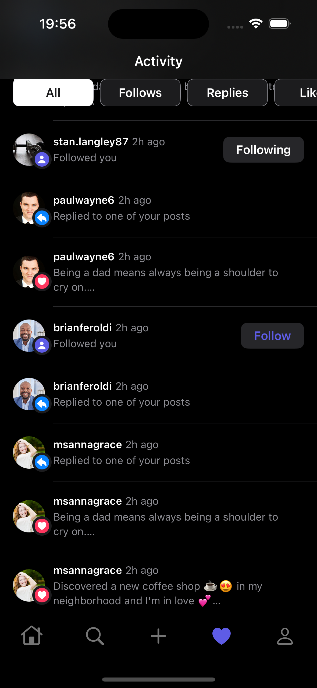

<!-- HEADER -->

<h1> SocialMedia App </h1>

[][Swift]
[][SwiftUI]
[][iOS]

<!-- BODY -->

## Preview

	
	
	
	
	
	
	
	
	
	
	

	
	
	
	
	
	
	
	
	
	
	

	

## Description
This project aims to replicate the core functionalities of any popular social media app, emphasizing user authentication, thread creation, real-time updates using firebase listeners, and a user-friendly interface built with SwiftUI. It leverages Firebase's robust backend services for seamless data management and real-time interactions.
This app was created for educational purposes and as a demonstration of SwiftUI and Firebase integration.

The app is still work in progress.

## Features:

* User Authentication: Users can sign up for new accounts or log in with existing credentials using secure Firebase Authentication.
* Feed View: A Top Tab Bar Container that allows browsing of scrollable feeds displaying all created posts or only following user posts in real-time.
* Search View: Search for specific users by name or username for easy navigation. Having the layout option of viewing as list or as icons. 
* Post Editor: Users can create posts with titles and optional images to spark discussions on various topics. 
* Activity View: View user activity, including posts likes, user followings and .
* User Profiles: View user profiles and see their activity history.
* Real-time Updates: Enjoy real-time updates when new threads or posts are created.
* Settings View: Manage user profile and account settings.
* Session Management: Combine publishers and subscribers ensure seamless user session handling throughout the app.

### Built with:
- SwiftUI
- Combine
- Asynchronous (async/await) Functions
- Firebase: Firebase is used for user authentication, real-time database, and cloud storage for media assets.
- Firebase Cloud Firestore: Store and retrieve data in real-time.
- Firebase Authentication: Securely manage user registration and login.
- Firebase Cloud Storage: Store and serve media files such as images.

### Improvements: 

- Implement the Repost feature.
- Implement the Search feature in the Post Grid to allow for post searching by title or caption keywords.
- Create support for adding multiple images when creating a post and viewing them in a horizontal paging scroll view. 
- Create support for adding and playing video media in posts.
- Displaying post replies bellow every post in posts grids. For now the replies are only visibile in the Post Detail screen.
- Enable Apple and Google authentication.

<!-- FOOTER -->
<!-- Permanent links -->
[Swift]: https://www.swift.org
[SwiftUI]: https://developer.apple.com/documentation/swiftui/
[iOS]: https://developer.apple.com/ios/
